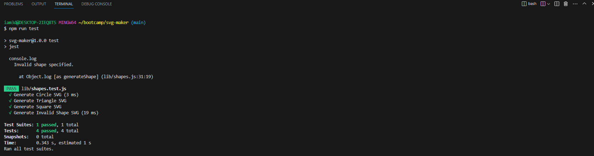
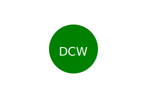
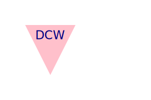

  # SVG Logo Maker
  
  ## Description 
  This application was created with [Node.js](https://nodejs.org/en), [Node.js File System Module](https://www.w3schools.com/nodejs/nodejs_filesystem.asp), [Inquirer](https://www.npmjs.com/package/inquirer), and [Jest](https://jestjs.io/). The application generates an SVG file based on user input.
  
  ## Table of Contents
  * [Technology Stack](#technology-stack)
  * [User Story](#user-story)
  * [Acceptance Criteria](#acceptance-criteria)
  * [Installation](#installation)
  * [Usage](#usage)
  * [Tests](#tests)
  * [Generated File Examples](#generated-file-examples)
  * [License](#license)

  ## Technology Stack

  
  

  ## User Story
  ```md
  AS a freelance web developer
  I WANT to generate a simple logo for my projects
  SO THAT I don't have to pay a graphic designer
  ```

  ## Acceptance Criteria
  ```md
  GIVEN a command-line application that accepts user input
  WHEN I am prompted for text
  THEN I can enter up to three characters
  WHEN I am prompted for the text color
  THEN I can enter a color keyword (OR a hexadecimal number)
  WHEN I am prompted for a shape
  THEN I am presented with a list of shapes to choose from: circle, triangle, and square
  WHEN I am prompted for the shape's color
  THEN I can enter a color keyword (OR a hexadecimal number)
  WHEN I have entered input for all the prompts
  THEN an SVG file is created named `logo.svg`
  AND the output text "Generated logo.svg" is printed in the command line
  WHEN I open the `logo.svg` file in a browser
  THEN I am shown a 300x200 pixel image that matches the criteria I entered
  ```
  
  ## Installation 
  * Ensure you are running Node.js v16.  
  * Clone the repository.
  ```
    git@github.com:iam3dski/svg-maker.git
  ```
  * Install the dependencies.
  ```bash
    npm i
  ```
  * Start the application.
  ```md
    node index.js OR npm start
  ```
  Answer the prompts to generate an SVG file.
  
  ## Usage
  
  [svg-maker.webm](https://github.com/iam3dski/svg-maker/assets/123909952/7fc92524-67be-408d-a708-3c135407010f)

  ## Tests 
  * Ensure you have installed the application.
  * Run the test.
  ```
    npm test
  ```
  * Expected output.

      

  ## Generated File Examples
  
    
    
  
  
  ## License 
  [](https://lbesson.mit-license.org/)
